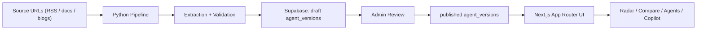

# AgentCodex

[](https://github.com/agentcodex-dev/agentcodex/actions/workflows/pipeline.yml)
[](https://www.agentcodex.dev/)


AgentCodex is a live intelligence desk for AI agents.  
It tracks release changes, capability movement, and version history so teams can decide faster with source-aware context.

## Why AgentCodex Exists

AI agent updates are scattered across blogs, changelogs, social posts, and docs.  
AgentCodex turns that noise into one decision surface:

- What changed recently?
- Which agents are moving fastest?
- Which tool fits this workflow today?

## Product Surfaces

- **Homepage (`/`)**: radar-led command surface for weekly change intelligence
- **Radar (`/radar`)**: latest releases, biggest movers, release velocity
- **Agents (`/agents`)**: searchable directory with metadata and version context
- **Agent Profile (`/agents/[slug]`)**: capability snapshot + release timeline
- **Compare (`/compare`, `/compare/[pair]`)**: side-by-side fit and tradeoff analysis
- **Copilot (`/copilot`)**: workflow preset shortlists
- **Methodology (`/methodology`)**: transparent scoring and comparison logic
- **Admin (`/admin`)**: draft approval workflow for pipeline output

## Architecture



## Quick Start (Web App)

### 1) Install dependencies

```bash
npm install
```

### 2) Create `.env.local`

```bash
NEXT_PUBLIC_SUPABASE_URL=
NEXT_PUBLIC_SUPABASE_ANON_KEY=
SUPABASE_SERVICE_KEY=
ADMIN_PASSWORD=
```

### 3) Run locally

```bash
npm run dev
```

Open [http://localhost:3000](http://localhost:3000).

### 4) Validate before push

```bash
npm run lint
npm run build
```

## Pipeline Quick Start

The ingestion pipeline is in [`pipeline/`](./pipeline).

### 1) Install Python deps

```bash
cd pipeline
pip install -r requirements.txt
```

### 2) Required env vars

```bash
ANTHROPIC_API_KEY=
SUPABASE_URL=
SUPABASE_SERVICE_KEY=
```

### 3) Run pipeline

```bash
python3 main.py
```

Calibrated scoring mode:

```bash
python3 main.py --scoring-mode calibrated
```

## Data Model (Core)

Primary tables:

- `agents`
- `agent_versions`
- `news_sources`
- `pipeline_seen_articles`
- `pipeline_runs`
- `pipeline_article_events`
- `version_editor_audits`

Public UI only reads `agent_versions` where `status = 'published'`.  
Pipeline writes drafts; admin reviews and publishes/rejects.

## Supabase Migrations

Migrations live in [`supabase/migrations/`](./supabase/migrations).

Apply current schema:

```bash
supabase db push
```

## Operator Commands

### Backfill for newly onboarded agents

```bash
# Dry run
python3 pipeline/main.py \
  --backfill \
  --agents codex,claude-code,aider,roo-code,continue \
  --max-links 25 \
  --max-age-days 3650 \
  --max-versions-per-article 20 \
  --dry-run

# Write mode
python3 pipeline/main.py \
  --backfill \
  --agents codex,claude-code,aider,roo-code,continue \
  --max-links 25 \
  --max-age-days 3650 \
  --max-versions-per-article 20
```

### Admin/testing helpers

```bash
python3 pipeline/admin_tools.py seed-onboarding-agents
python3 pipeline/admin_tools.py create-test-draft --agent-slug claude
python3 pipeline/admin_tools.py delete-test-drafts
python3 pipeline/admin_tools.py detect-misclassified
python3 pipeline/admin_tools.py reassign-misclassified
python3 pipeline/audit_sources.py
```

### Score calibration checks

```bash
python3 pipeline/score_snapshot.py --out-prefix pipeline/artifacts/score_snapshot

python3 pipeline/score_diff_report.py \
  --before pipeline/artifacts/score_snapshot_BASELINE.json \
  --after pipeline/artifacts/score_snapshot_CANDIDATE.json \
  --max-change-ratio 0.35 \
  --max-abs-delta 5.0

python3 -m unittest pipeline.tests.test_score_tools
python3 -m unittest pipeline.tests.test_scoring
```

## Environment and Deployment Notes

- Web app is designed for **Vercel + Supabase**
- Daily pipeline runs from [`.github/workflows/pipeline.yml`](./.github/workflows/pipeline.yml)
- Ensure secrets are set in GitHub Actions and Vercel
- `dev` and `build` use webpack in this workspace to avoid unsupported SWC WASM fallback issues

## Roadmap (Current Direction)

- Improve release-source auditing coverage and confidence
- Expand watchlist/alerting workflows
- Continue decision-intelligence polish for compare and copilot flows
- Harden monetization and reporting flows with production-safe guardrails

## Contributing

PRs are welcome. Keep changes scoped and tested.

Suggested branch prefixes:

- `feature/*`
- `fix/*`
- `hotfix/*`

Before opening a PR:

1. Run `npm run lint`
2. Run `npm run build`
3. Add or update tests when behavior changes
4. Include screenshots for UI-visible changes

## Links

- Live product: [agentcodex.dev](https://www.agentcodex.dev/)
- Methodology: [agentcodex.dev/methodology](https://www.agentcodex.dev/methodology)
- Radar: [agentcodex.dev/radar](https://www.agentcodex.dev/radar)
